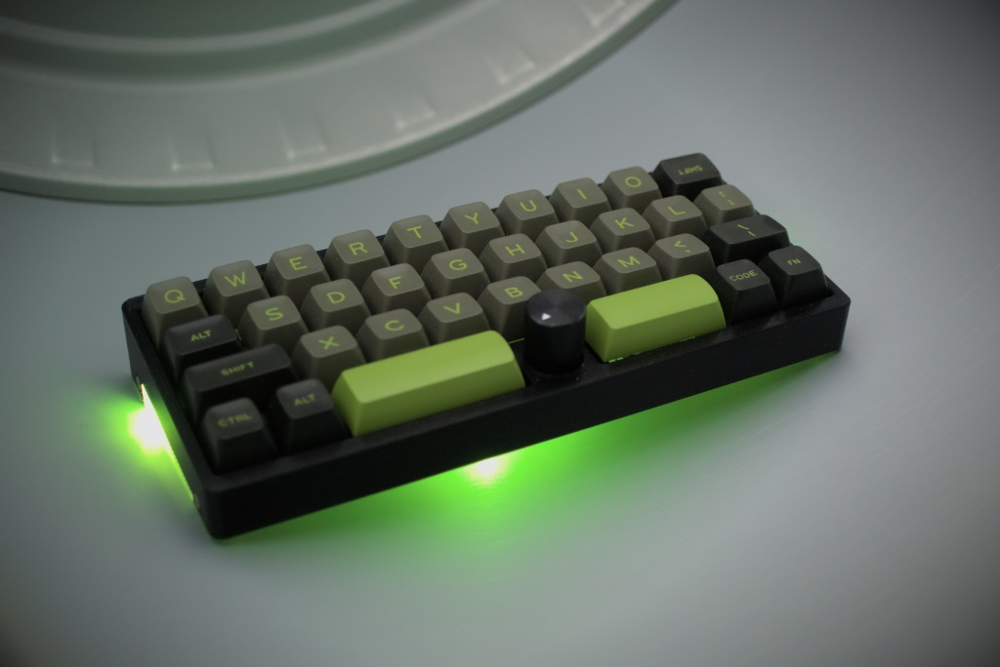

# KEZ

[![CC BY-NC-SA 4.0][cc-by-nc-sa-shield]][cc-by-nc-sa]

A 3D printed, handwired, wireless keyboard with 35 key QAZ-like layout and a center rotary encoder.

- The case is based on [QEZ](https://github.com/kb-elmo/QEZ) by kb-elmo
- Wireless via Bluetooth thanks to [nice!nano](https://nicekeyboards.com/nice-nano)
- Powered by [ZMK Firmware](https://zmk.dev/)
- Optional RGB underglow or accent color on the sides

[[ZMK Firmware](https://github.com/waht/kez_zmk_firmware/)] - [[More Pictures](/pics)]

## BOM / Parts

| Part                         | Quantity | Notes                                                                                                                                                                                   |
| :--------------------------- | :------: | :-------------------------------------------------------------------------------------------------------------------------------------------------------------------------------------- |
| nice!nano v2                 |    1     | Other Pro-Micro compatible MCUs should work but might not fit in the case                                                                                                               |
| MX Switches                  |    35    |
| 2u Plate Mounted Stabilizers |    2     | Optional                                                                                                                                                                                |
| 1N4148 Diodes                |    36    | One for every switch plus one for the encoder push switch                                                                                                                               |
| EC11 Rotary Encoder          |    1     |
| 16-17mm Knob                 |    1     | For rotary encoder                                                                                                                                                                      |
| LiPo Battery                 |    1     | Optional. Recommended dimensions: 48 x 22 x 6mm                                                                                                                                         |
| Wire                         |          | For wiring the circuit. Thin enamel copper wire recommended.                                                                                                                            |
| SK6812 Mini-E                |   3-4    | Optional RGB LEDs for underglow                                                                                                                                                         |
| Foam Rubber Strips           |    8     | Gaskets for the plate: 50 x 3.5mm - 4 with 2mm height for bottom case & 4 with 1.5 mm height for top case. 2mm height can also be achieved by adding double sided tape to 1.5mm strips. |
| M2x4mm                       |    4     | Screws for holding top and bottom part together                                                                                                                                         |

### 3D Printed Parts

| Part                  | Quantity | Notes                                                                                               |
| :-------------------- | :------: | :-------------------------------------------------------------------------------------------------- |
| Case Top              |    1     | Choose either normal or HHKB variant                                                                |
| Case Bottom           |    1     | Choose a different color from top or print transparent for RGB underglow                            |
| Case Plate            |    1     |
| MX Switch Sockets     |    35    | Optional but highly recommended, see https://github.com/JanLunge/keyboards/tree/main/hotswap_socket |
| SK6812 Mini-E Sockets |   3-4    | Optional but recommended, see https://www.printables.com/de/model/380698-sk6812-mini-e-socket       |

## Building

1. Print the parts
1. If using the switch sockets, add [wires and diodes to sockets](https://www.youtube.com/watch?v=v9r5DKZLz68&t=180s)
1. Put switches into the plate (and connect to optional sockets)
1. Wire according to [the matrix](/pics/matrix.png). The matrix picture shows the top view - Check out [wiring guides](https://github.com/samhocevar-forks/qmk-firmware/blob/master/docs/hand_wire.md#wiring-the-matrix) if you need help for this.
1. Connect matrix and encoder to nice!nano. **Due to the limited space, directly soldering the wires to the pins is recommended (e.g. form a wire loop through the pcb). Having sockets will take up too much height.**
1. Add LEDs to bottom (recommended arrangements are one left, one right, one center or two left and two on the right). Using the optional LED sockets, they can be assembled outside of the case and glued in place. Daisy chain the LEDs using DIN & DOUT pins. For ease of assembly use a three pin socket when connecting the nice!nano to bottom LED wiring.
1. Add foam strips to top and bottom case where the plate will rest
1. Mount encoder to top case using nut
1. Slide nice!nano into bottom case (and add battery - 90 degree socket pins fit at the deep end of the bottom case)
1. Put plate on bottom case
1. Add top case and screws

Use the following pin mapping for nice!nano

| Name        |   Pin | Note                                                                                   |
| :---------- | ----: | :------------------------------------------------------------------------------------- |
| Column 0    | P1.13 |
| Column 1    | P1.11 |
| Column 2    | P0.10 |
| Column 3    | P0.09 |
| Column 4    | P1.06 |
| Column 5    | P1.04 |
| Column 6    | P0.11 |
| Column 7    | P1.00 |
| Column 8    | P0.24 |
| Column 9    | P0.22 |
| Row 0       | P0.31 |
| Row 1       | P0.29 |
| Row 2       | P0.06 | Seems like I killed pin P0.02/D19 at some point. Treat your MCU nicely when soldering! |
| Row 3       | P1.15 |
| LED VDD     |   VCC | All LEDs                                                                               |
| LED VSS     |   GND | All LEDs                                                                               |
| LED Din     | P0.08 | Connect only first LED                                                                 |
| LED Dout    |     - | Connect all subsequent LEDs in series                                                  |
| Encoder A   | P0.20 | Left                                                                                   |
| Encoder B   | P0.17 | Right                                                                                  |
| Encoder GND |   GND |
| Encoder SW  |     - | Wired to the matrix like a normal switch                                               |

## Printing

The models are aligned as assembled, so parts need to be flipped for printing.
Unless otherwise noted, use 100% infill. Prints in photos have a layer height of 0.2mm. 5 perimeters recommended.

- Plate needs to be flipped and prints without supports.
- Top needs to be flipped and requires supports for the encoder mount.
- Bottom needs to be rotated slightly so it sits flat on build surface.

## Underglow

Note that SK6812 LEDs are specced for 5V but this build uses the nice!nanos' VCC pin which only provides 3.3V. It is possible to add a voltage conversion circuit, but I drive my LEDs at 3.3V without a voltage converter and it works mostly fine. The only side effect I noticed was that sometimes when the battery is low, some colors will not work anymore.

---

This work is licensed under a
[Creative Commons Attribution-NonCommercial-ShareAlike 4.0 International License][cc-by-nc-sa].

[![CC BY-NC-SA 4.0][cc-by-nc-sa-image]][cc-by-nc-sa]

[cc-by-nc-sa]: http://creativecommons.org/licenses/by-nc-sa/4.0/
[cc-by-nc-sa-image]: https://licensebuttons.net/l/by-nc-sa/4.0/88x31.png
[cc-by-nc-sa-shield]: https://img.shields.io/badge/License-CC%20BY--NC--SA%204.0-lightgrey.svg
